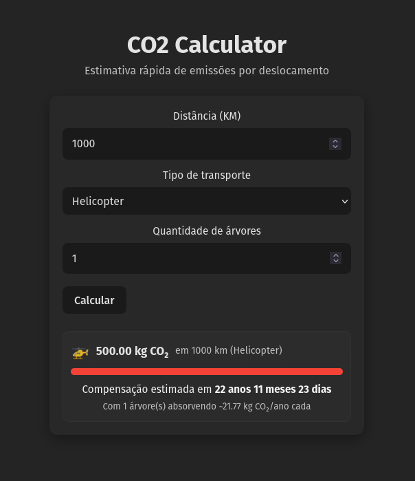
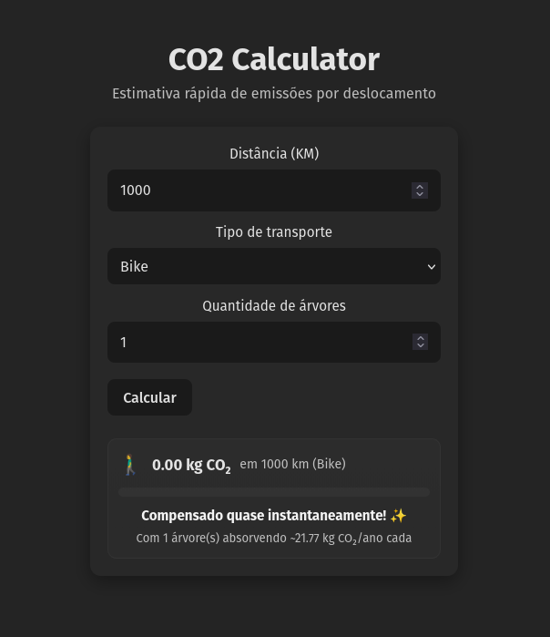

# CO2-Calculator

Pequena aplicação React para estimar emissões de CO₂ por deslocamento e comparar com a capacidade de absorção de árvores.

## Visão geral
- Formulário para informar distância (km), tipo de transporte e quantidade de árvores.
- Cálculo simples de emissões (g CO₂ por passageiro-km → resultado em kg).
- Estimativa de tempo para compensação com base na absorção média de ~21.77 kg CO₂/árvore/ano.

## Principais arquivos
- Componente de cálculo: [`DistanceForm`](src/DistanceForm.jsx) — [src/DistanceForm.jsx](src/DistanceForm.jsx)  
- Página principal: [`MainPage`](src/mainpage.jsx) — [src/mainpage.jsx](src/mainpage.jsx)  
- Entrada da aplicação: [src/main.jsx](src/main.jsx) — monta o [`App`](src/App.jsx)

## Rodando localmente
1. Instale dependências:
   npm install
2. Inicie em modo dev:
   npm run dev

## Capturas de tela
Interface com bicicleta (exemplo):

Interface com helicóptero (exemplo):

> Observação: coloque as imagens na pasta `./screenshots/` com os nomes acima.

## 🎓 Contexto do Projeto

Este projeto foi desenvolvido como parte do **Bootcamp de Desenvolvimento com GitHub Copilot da [DIO](https://www.dio.me/)**.

O objetivo principal foi explorar as capacidades do **GitHub Copilot** como assistente de produtividade (Pair Programming), desde a estruturação de componentes React até a implementação de lógicas de cálculo de impacto ambiental e feedback visual dinâmico.

---
Desenvolvido por Raphael Scheidegger durante a jornada de aprendizado em IA aplicada ao código.

## Licença
MIT